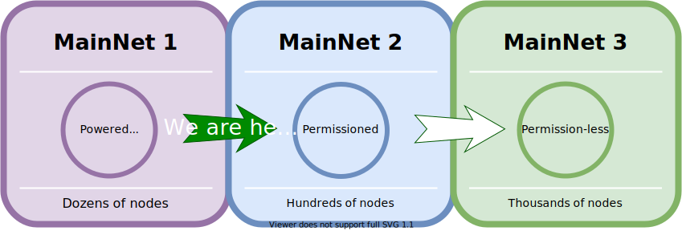
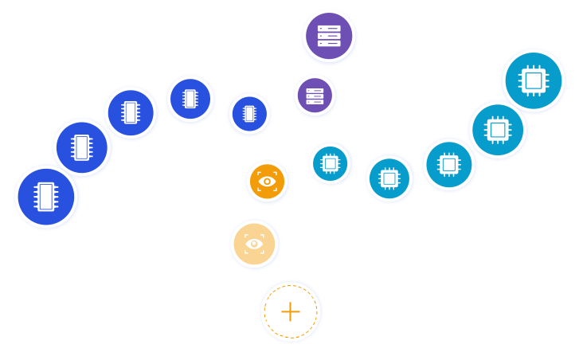
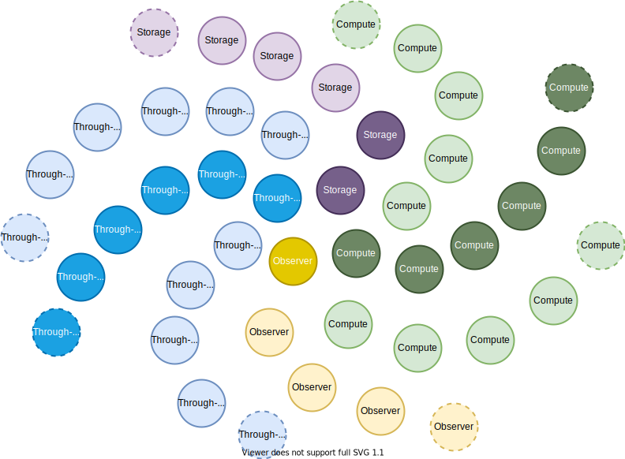
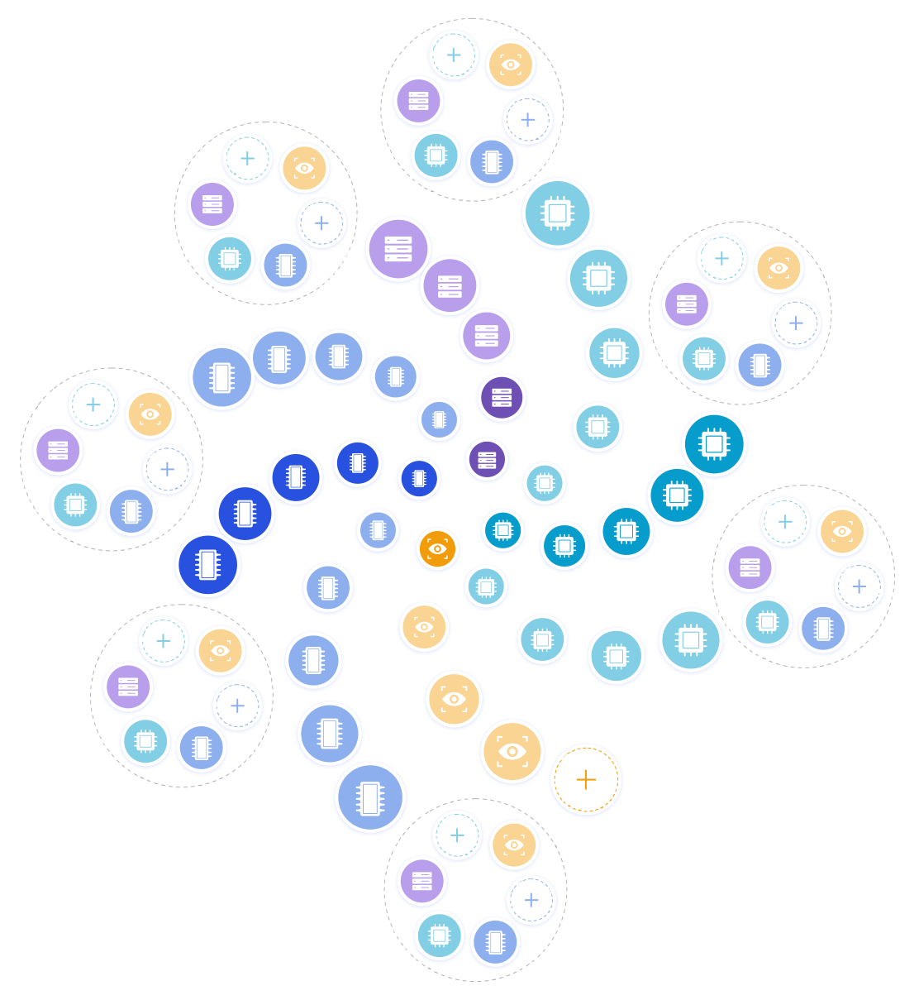
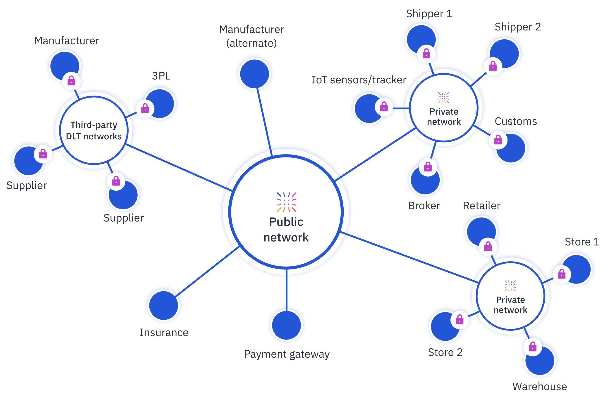

.. _path_to_decentralization:

Path to decentralization
========================

Insolar plans to grow and support a decentralized infrastructure with a plethora of participants.

Insolar’s path to decentralization is straightforward and can be illustrated as follows:

An eagle view of the MainNet maturity roadmap that leads to decentralization is in the following table:

.. |br| raw:: html

    

+-----------------+-------------------------------+-------------------------------+-------------------------------+
|                 | MainNet 1                     | MainNet 2                     | MainNet 3                     |
+=================+===============================+===============================+===============================+
| Execution nodes | Permissioned, |br|            | Permissioned, |br|            | *Permissionless*, |br|        |
|                 | provided by Insolar Foundation| provided by trusted parties   | provided by anybody           |
+-----------------+-------------------------------+-------------------------------+-------------------------------+
| Observer nodes  | Permissioned, |br|            | *Permissionless*, |br|        | *Permissionless*, |br|        |
|                 | deployed and used |br|        | deployed and used |br|        | deployed and used |br|        |
|                 | by trusted parties            | by anybody                    | by anybody                    |
+-----------------+-------------------------------+-------------------------------+-------------------------------+
| Governance      | Managed by Insolar Foundation | Basic governance              | *Advanced on-chain*           |
|                 |                               |                               | *governance*                  |
+-----------------+-------------------------------+-------------------------------+-------------------------------+
| Staking         | Delegated Proof-of-Stake |br| | Delegated Proof-of-Stake |br| | Delegated Proof-of-Stake |br| |
|                 | (DPoS)                        | (DPoS)                        | (DPoS)                        |
+-----------------+-------------------------------+-------------------------------+-------------------------------+

.. dropdown:: :fa:`eye,mr-1` Open this drop-down section to find more details on the features from the table above.
   :animate: fade-in-slide-down

   **MainNet 1**

   **Execution nodes** :badge:`"Permissioned and owned by Insolar Foundation",badge-info`

   * Limited number of nodes. All nodes managed by the Insolar Foundation.
   * All code of the MainNet — core, custom contracts, observer nodes — is open on Github.

   **Observer nodes** :badge:`"Permissioned, installed and used by trusted parties",badge-primary`

   * Observer nodes can be compiled from source code and installed by authorized well-known partners.
   * Access of observer nodes is permissioned: partners have to get explicit credentials from Insolar Foundation.

   **Governance** :badge:`"Managed by Insolar Foundation",badge-info`

   * Custom contracts can be uploaded and updated only with direct participation of the Insolar Foundation.

   **Staking** :badge:`"Delegated Proof-of-Stake (DPoS)",badge-success`

   * Users can delegate their stake for nodes.

   **MainNet 2**

   **Execution nodes** :badge:`"Permissioned, provided by trusted parties",badge-primary`

   * Well-known partners (Insolar Association) will run nodes, maintain their private keys, and monitor their operations.
   * Network will consist of up to 500 nodes of all types.
   * Improved TPS capacity: linear scalability on throughput when adding more processing, throughput, and storage nodes.

   **Observer nodes** :badge:`"Permissionless, installed and used by anybody",badge-success`

   * Anyone  will be able to run Observer nodes and register them on a web portal, so Insolar Association can ensure load balancing and support.

   **Governance** :badge:`"Basic governance",badge-success`

   * Users can create new applications by uploading their own custom contracts.
   * Network and applications are managed by the Insolar Association.

   **Staking** :badge:`"Delegated Proof-of-Stake (DPoS)",badge-success`

   * Users can delegate their stake to nodes. In turn, the nodes get to process more valuable transactions.

   **MainNet 3**

   **Execution nodes** :badge:`"Permissionless, provided by anybody",badge-success`

   * Third-party nodes can join according to governance policies.
   * The network can grow and connect multiple Insolar Clouds, as well as integrate with networks from other DLT providers.

   **Observer nodes** :badge:`"Permissionless, installed and used by anybody",badge-success`

   **Governance** :badge:`"Advanced on-chain governance",badge-success`

   * Special governance framework is implemented for managing the network (nodes) and applications. Its rules are initially set up by the Insolar Association, and later can be modified in accordance with the collective decision by the Insolar XNS coin holders.

   * General governance framework defines:

      * Procedures and policies for joining new nodes to the network. Anybody can submit their nodes for joining.
      * Procedures and policies for creating new applications. Any developer can submit their application to the MainNet as a set of new smart contracts which adhere to predefined governance rules.
      * Procedures and policies are defined for uploading and updating custom contracts.

   **Staking** :badge:`"Delegated Proof-of-Stake (DPoS)",badge-success`

   * Besides vouching for the nodes, users can delegate their stake for applications.

What infrastructure powers Insolar MainNet?
-------------------------------------------

The MainNet’s little “galaxy” consists of multiple nodes:

.. important::

   All nodes (except Observers) on the network exchange data, and all are subject to the BFT-like consensus.

Insolar runs all the dark-colored nodes. The nodes have several static roles:

* (Green) VN—virtual nodes with powerful CPUs for smart contract execution.
* (Blue) LMN—light material nodes with lots of RAM for block building and caching.
* (Purple) HMN—heavy material nodes with fast SSDs for quick access to long-term storage.
  
.. note::

   (Dark and light yellow) Observer nodes do not participate in consensus, they replicate the finalized MainNet data and rebuild the data in a relational form.
    
   In particular, this allows to check data consistency and immutability over time. Read more on Observer nodes below.

For more information on node roles, see the :ref:`Multi-role nodes <multi_role_nodes>` section.

In addition to the static roles, all nodes have dynamic ones: executor and validator. During each pulse, nodes are assigned dynamic roles for object processing. Dynamic role allocation is the basis of the platform’s security and scalability. For more information, see the :ref:`Dynamic roles <dynamic_roles>` section.

So, to decentralize an Insolar network, third parties only need to run more executor and validator (dynamic) nodes of all the static roles. For more information, see the :ref:`Execution and validation <execution_validation>` section.

Observer nodes
^^^^^^^^^^^^^^

Moreover, Observer nodes (yellow on the diagram) complement the network. These nodes implement important functions:

* Replicate all the data stored by a heavy node. This data is by definition finalized.
* Transform a mesh of custom smart contracts and their interactions into business objects and transactions between them. You can easily query these objects and transactions to build fast and efficient analytics applications with excellent UX.
* Provide a fast report service that offloads read requests from the blockchain.
* Allow every participant to check data consistency and immutability over time.

Currently, Observer nodes can only be run by trusted third parties: top-tier universities, enterprises, and exchanges.

.. panels::
    :card: shadow
    :column: col-lg-12 p-2

    .. link-button:: https://github.com/insolar/observer
        :type: url
        :text: Run your own Observer node
        :classes: btn-link stretched-link font-weight-bold
        :tooltip: GitHub repository

    .. div:: text-muted

        :opticon:`mark-github` If you are an exchange developer, deploy a node that replicates MainNet data

The next step towards decentralization
--------------------------------------

As Insolar moves along its path to decentralization:

* Observer nodes become permissionless.
* Executor nodes can be run by trusted third parties.
* "Galaxy" arms increase in number and grow.

In the diagram above:

* Dark-colored nodes are those run by Insolar.
* Light-colored nodes are those run by selected third-parties: top-tier universities, enterprises, and exchanges.
* Yellow Observer nodes are permissionless.
* Dotted nodes designate increasing numbers of nodes of different roles: Observers, VNs, LMNs, HMNs.

Becoming decentralized
----------------------

Further along the path to decentralization, all the nodes of the main network become permissionless. However, this does not hurt the desire of enterprises for a way to restrict access to sensitive data.

Enterprises can deploy private networks with complex permissioning schemes. In turn, private networks seamlessly integrate in a :ref:`hybrid manner <pub_v_priv_and_permissioned_v_permissionless>` with the Insolar’s public network. A single on-chain governance model manages the resulting decentralized network.

Initially, Insolar Association sets up a governance framework with rules for managing the network nodes and applications.

.. note:: The Insolar Association will be made up of a group of 100 diverse organizations from around the world. The association members each will be running up to 10 executor nodes on the Insolar Network.

The MainNet users can later modify the rules in accordance with a collective decision.

The general governance framework defines procedures and policies for:

* Joining new nodes to the network. Anybody can submit their nodes for joining.
* Creating new applications. Any developer can submit their application to the MainNet as a set of new smart contracts that adhere to predefined governance rules.
* Uploading and updating custom contracts.

As a result, the “galactic” growth culminates in a merger with other “galaxies”, public and private, to give birth to an Insolar “Universe”.

In the diagram above, “clusters” at the end of “galactic” arms are growing private networks run by various enterprises.

Bridging to other DLTs
----------------------

Furthermore, as discrete blockchain networks grow and expand, they will increasingly need to interact with one another. Insolar’s global network bridges to other blockchain networks and becomes a  “constellation”.

Bridges facilitate seamless, trusted, low-friction interactions between enterprises.